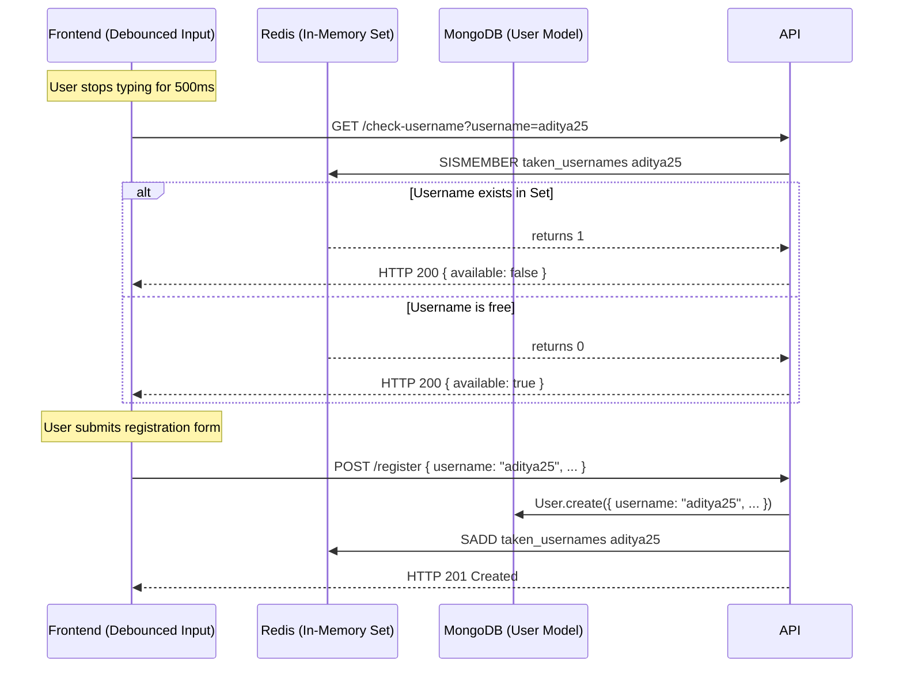
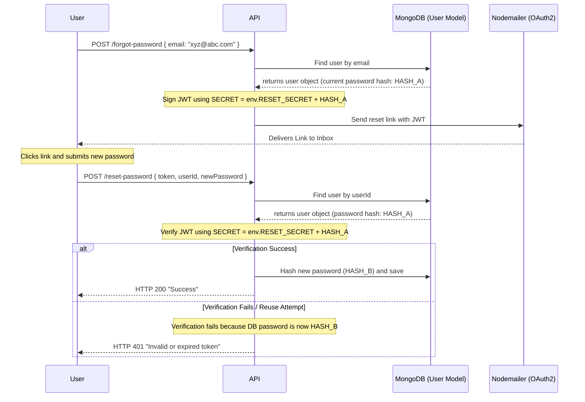
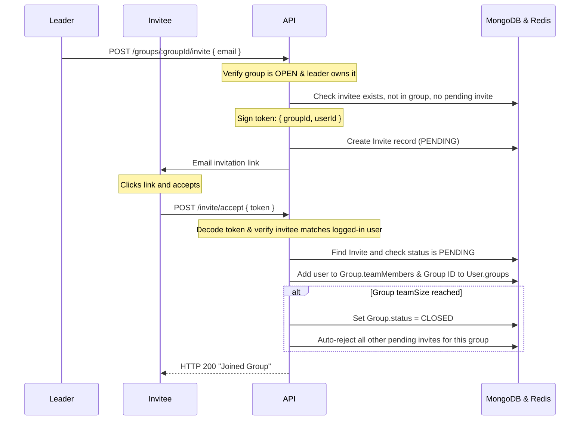
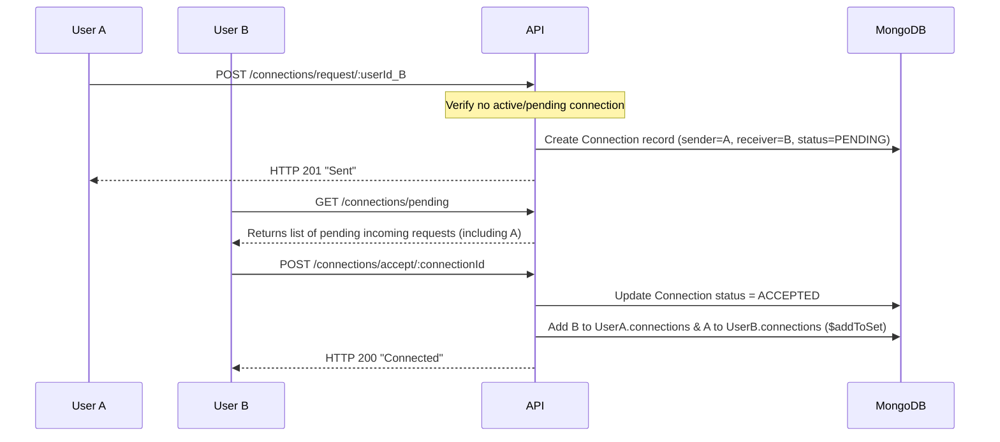

# METoS API Documentation & Flows

This document details the route list, parameter shapes, security mechanisms, Redis implementation details, and sequential user flows of the METoS Backend API.

---

## Security & Middleware (verifyJWT)
Most mutating and private endpoints are protected by the `verifyJWT` middleware.
- **Authorization check:** The token is read from the `Authorization: Bearer <token>` header or the `accessToken` httpOnly cookie.
- **Payload mapping:** Maps token identifiers to `req.user`, excluding sensitive info (password, refresh tokens).
- **Session management:** Uses short-lived Access Tokens paired with long-lived Refresh Tokens stored securely in HTTPOnly cookies.

---

## Redis Cache Implementation Details

To handle real-time username availability checks with high performance, Redis is integrated as an in-memory cache layer. 

### Data Structure
- **Redis Set (`taken_usernames`):** We use a Redis Set to store all registered usernames in lowercase. Sets ensure uniqueness and allow O(1) membership checks.

### Core Commands Used
1. **`SISMEMBER taken_usernames <username>`**: Used during the check endpoint. Returns `1` if the username is taken, and `0` if it is free.
2. **`SADD taken_usernames <username>`**: Adds a new username to the set on user registration.
3. **`SREM taken_usernames <username>`**: Removes a username from the set (useful for username updates or user deletions).

### One-Time Synchronization (Hydration)
If existing users exist in MongoDB, the `syncUsernamesToRedis` utility script loads all usernames from MongoDB using a lean query (`User.find({}, "username").lean()`), converts them to lowercase, and bulk-inserts them into the Redis Set using pipeline insertion (`redis.sadd`).

---

## Route Directory

### 1. Authentication (`/api/v1/auth`)

| Method | Route | Auth | Description |
| :--- | :--- | :--- | :--- |
| **POST** | `/register` | Public | Registers a new user. Cache-injects username into Redis. |
| **POST** | `/login` | Public | Logs in. Sets HTTPOnly cookies for tokens. |
| **POST** | `/logout` | 🔒 Private | Destroys cookies and clears refresh token in DB. |
| **POST** | `/refresh` | Public | Swaps refresh token (cookie/body) for a new pair. |
| **GET** | `/me` | 🔒 Private | Retrieves current authenticated profile. |
| **PUT** | `/update` | 🔒 Private | Updates bio, location, headline, socialLinks, skills. |
| **PUT** | `/darkmode` | 🔒 Private | Toggles the user interface dark mode flag. |
| **GET** | `/check-username` | Public | Checks if a username is available in Redis (O(1)). |
| **POST** | `/forgot-password` | Public | Dispatches single-use password reset link. |
| **POST** | `/reset-password` | Public | Updates user password using reset token. |

---

### 2. Group Management (`/api/v1/groups`)

| Method | Route | Auth | Description |
| :--- | :--- | :--- | :--- |
| **GET** | `/` | Public | Lists and searches all groups (paginated). |
| **GET** | `/my` | 🔒 Private | Lists groups where the caller is leader or member. |
| **POST** | `/` | 🔒 Private | Creates a new group. Leader slot is separate from members. |
| **GET** | `/:groupId` | Public | Fetches a single group with computed `slotsLeft`. |
| **PUT** | `/:groupId` | 🔒 Leader | Updates details (cannot shrink size below active members). |
| **PATCH** | `/:groupId/close`| 🔒 Leader | Manually closes group; auto-rejects pending invites. |
| **DELETE**| `/:groupId/leave`| 🔒 Member | Non-leader leaves group; re-opens if size limit permits. |
| **DELETE**| `/:groupId` | 🔒 Leader | Deletes group; cascades cleanup to members and invites. |

---

### 3. Invitation System (`/api/v1`)

| Method | Route | Auth | Description |
| :--- | :--- | :--- | :--- |
| **POST** | `/groups/:groupId/invite` | 🔒 Leader | Emails signed, non-transferable token to invitee. |
| **POST** | `/invite/accept` | 🔒 Private | Accepts invitation; joins group. |
| **POST** | `/invite/reject` | 🔒 Private | Rejects invitation. |
| **GET** | `/invite/pending` | 🔒 Private | Lists all pending invitations for the caller. |

---

### 4. Connection System (`/api/v1/connections`)

| Method | Route | Auth | Description |
| :--- | :--- | :--- | :--- |
| **GET** | `/` | 🔒 Private | Lists all accepted developer connections (peer-to-peer). |
| **GET** | `/pending` | 🔒 Private | Lists incoming connection requests. |
| **GET** | `/sent` | 🔒 Private | Lists outgoing connection requests. |
| **POST** | `/request/:userId` | 🔒 Private | Sends a connection request. |
| **POST** | `/accept/:connectionId` | 🔒 Private | Accepts an incoming request. |
| **POST** | `/reject/:connectionId` | 🔒 Private | Rejects an incoming request. |
| **DELETE**| `/cancel/:connectionId` | 🔒 Private | Cancels an outgoing request. |
| **DELETE**| `/:userId` | 🔒 Private | Removes an established connection. |

---

### 5. Project Portfolio (`/api/v1/projects`)

| Method | Route | Auth | Description |
| :--- | :--- | :--- | :--- |
| **GET** | `/my` | 🔒 Private | Lists all projects owned by the caller. |
| **POST** | `/` | 🔒 Private | Creates a project and updates owner array. |
| **GET** | `/:projectId` | Public | Fetches detailed project data. |
| **PUT** | `/:projectId` | 🔒 Owner | Updates project title, stack, descriptions, URLs. |
| **DELETE**| `/:projectId` | 🔒 Owner | Deletes project and pulls reference from user profile. |

---

### 6. Public User Discovery (`/api/v1/users`)

| Method | Route | Auth | Description |
| :--- | :--- | :--- | :--- |
| **GET** | `/search` | Public | Queries users by name or username (paginated). |
| **GET** | `/id/:userId` | Public | Fetches user profile by ObjectId. |
| **GET** | `/:username` | Public | Fetches user profile by username. |

---

## Core Architectural Flows

### 1. Real-time Username Availability Flow

---

### 2. Single-Use Password Reset Flow
To prevent link-reuse vulnerabilities without storing state in MongoDB, tokens are signed using the user's current hashed password as part of the JWT secret.

---

### 3. Secure Group Invite & Acceptance Flow
Signed invitation tokens are tied specifically to the target group and invitee ID, preventing token-hijacking or link sharing.

---

### 4. Bidirectional Connection Flow
Matchmaking relationships are direction-agnostic and synced across both user profiles atomically.

